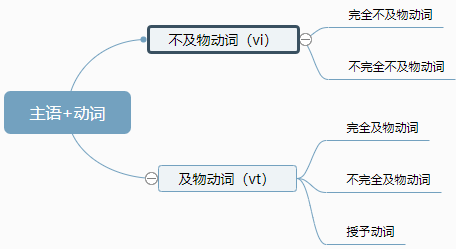

#! https://zhuanlan.zhihu.com/p/157810641
# 英语语法 —— 五大句型

## 五大句型

五大句型是根据动词的分类而来，动词的分类如下图

**根据动词我们可以将英语中简单的句型分为下面五中**

 - 完全不及物动词衍生的简单句 `S + Vi.`
 - 不完全不及物动词衍生的简单句 `S + Vi. + P(表语)`
 - 完全及物动词衍生的简单句 `S + Vt. + O(宾语)`
 - 不完全及物动词衍生的简单句 `S + Vt. + O(宾语) + C(宾补)`
 - 授予动词衍生的简单句 `S + Vt. + O(人) + O(物)`

> 说明：
> 1. 不及物动词可以认为是不提及他物; 
> 2. 及物动词 —— 提及它物
> 3. 区分及物动词还是不及物动词最好的方法是用被动方法，及物动词有被动语态
> 4. 不完全不及物动词衍生的简单句中，P(表语)修饰的 主语S, 也被称为主语补语（S = P）
> 4. 完全及物动词衍生的简单句中  O(宾语)修饰的及物动词Vt, 而不是主语

## 句型例句

### 主语 + 不及物动词 （S+Vi.）

不及物动词本身就可以表达完整的意思，不需要宾语及补语，有时可以有副词、介词短语等状语修饰，常见的不及物动词 `faint 晕倒了` 、`appear 出现` 、`arrive 倒带` 、`go 走了` 、 `exist 存在` 、 `rise 升起` 等，下面例句：

- `He fainted. /feintid/` 他晕倒了 faint 不及物动词
- `He went to the station.` 他去火车站了。 to the station做 介词短语(adv)作状语

- `Things change.` 事物实惠变化的
- `Here comes the man.` 那人来了 （这种类似 there/here + Vi. + 主语）

### 主语 + 不完全不及物动词 + 表语 `S + Vi. + P`

一般这里的不完全不及物动词指系动词，系动词本身不能表达完整的意思，需要形容词、介词短语、名词等来补充说明主语，常见的系动词

1. 表示转变或结果的系动词 `get 得到`、`grow 成长`、`turn 变成`、`come 来`、`go 去`、`become 成为`

2. 表示状态的系动词 `be动词`、`look看上去`、`seem 看起来`、`sound 听起来`、`smell 闻起来`、`feel 摸起来`、`tast 尝起来`、`keep 保持`、`remain 仍然是`。

**例句：**

- `My health has grown better` 我的健康状况有所好转
- `The little boy became an English teacher` 小男孩变成了一名英语老师
- `He looks sad` 他看起来不高兴
- `The idea shounds wonderful` 这个主意听起来很棒

### 主语 + 完全及物动词 + 宾语 `S + Vt. + O`

这种句型中完全及物动词后必须接上宾语，宾语的成分一般是名词、代词、动词不定式、动名词或从句。为了使句子表达更准确，句子中有时可以带宾语有关的状语。

- `He wants to do it` 他要做此时 （+ 不定时）。
- `They enjoy dancing` enjoy后接动名词做宾语
- `She lost her wallet in the street` 她在街上丢了钱包
- `I don't know how to do it` 我不知道如何做此时。know 为完全及物动词，后面跟名词短语做宾语（how to do it）
- `I wonder when he'll come` 我不知道他什么时候来。 wonder 作为完全及物动词，后面跟名词性从句做宾语（when he'll come） 

### 主语 + 不完全及物动词 + 宾语 + 宾语补语 `S + Vt. + O + O`

该句型中不完全及物动词后面只跟一个宾语不能把句意表达清楚，后面必须接补语意思才能完成。常见的动词如`see 看见`、`let 使`、`smell 闻到`、`make 使`。 **宾语+宾语补语** 一般称为 **复合宾语**。补语常常是名称、形容词、副词、分词、动词不定时、介词短语等

- `I fount the movie interesting` 我发现这部电影挺有趣。interestring 做 movie 的补语
- `He made me happy` 他是我高兴。happy形容词做补语
- `We elected him the monitor` 我们选他当班长。
- `I allowed him to stay here` 我允许他待在这。 不定式做补语

### 主语 + 授予动词 + 间接宾语 + 直接宾语 `S + Vt. + O(人) + O(物)`

**这个句型也可以称为** `主语 + 授予动词 + 宾语（授予对象） + 宾语补语（被授予的东西）`

授予动词后跟双宾语，一个指人，一个指物。指人的为间接宾语，指物的为直接宾语。一般情况下，间接宾语在前，直接宾语在后。如果直接宾语是人称代词，则必须把直接宾语放在间接宾语之前。

- `Please pass me a cup of tea.`  me 为宾语  tea 为宾补（直接宾语）
- `I gave him a book`
- `Show me your new book, please.`

如果把间接宾语放在直接宾语之后，间接宾语前需要加介词 `to` 或 `for`,这主要取决于谓语动词。

加`to`的动词有：`give 给予`、`tell 告诉`、`sell 卖`、`show 出示`、`hand 交给`、`return 交还`、`pass 递给`、`leave 留给`、`offer 提供`等

加`for`的动词有：`get 得到`、`choose选择`、`make制作`、`buy 买`、`order 订购`、`do 做`、`sing 唱歌`。

- `I gave a book to him`
- `I told a lie to hime`
- `Tom's mother bought a pair of new shoes for hime`

**需要注意的是** 直接宾语和宾语补足语要区分开，宾语补足语和宾语存在逻辑上的主谓关系。

- `I asked him to go with me` to go with me 是宾语补语，而不是直接宾语